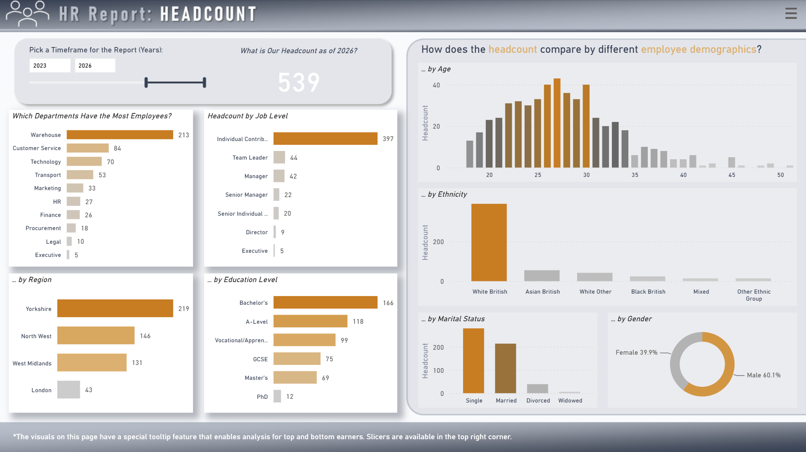
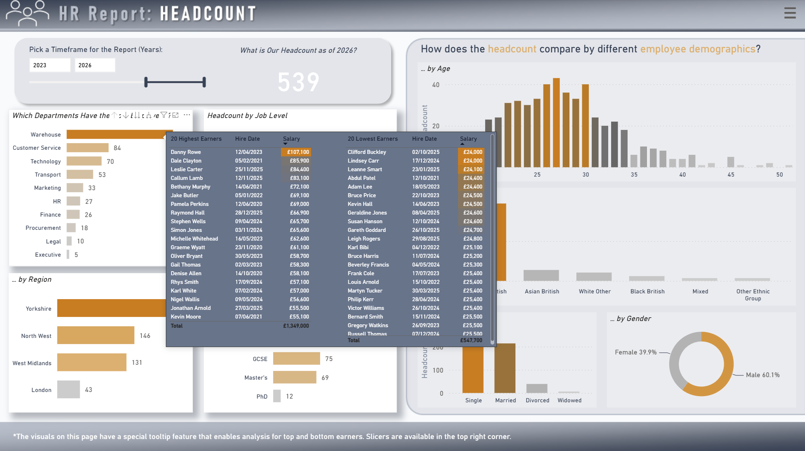
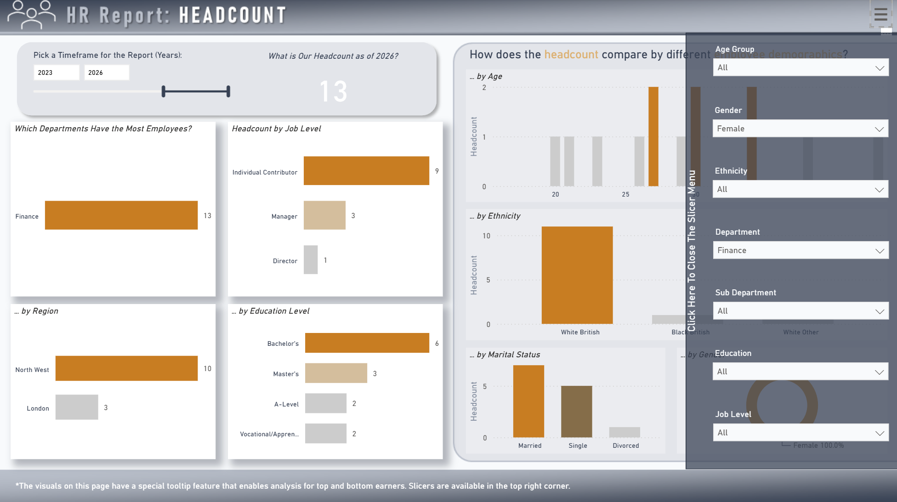
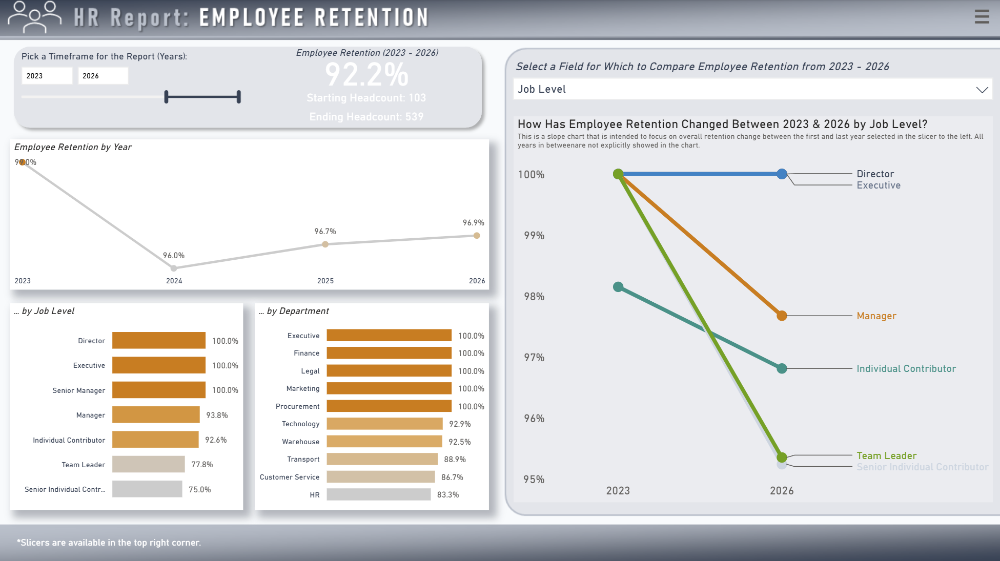
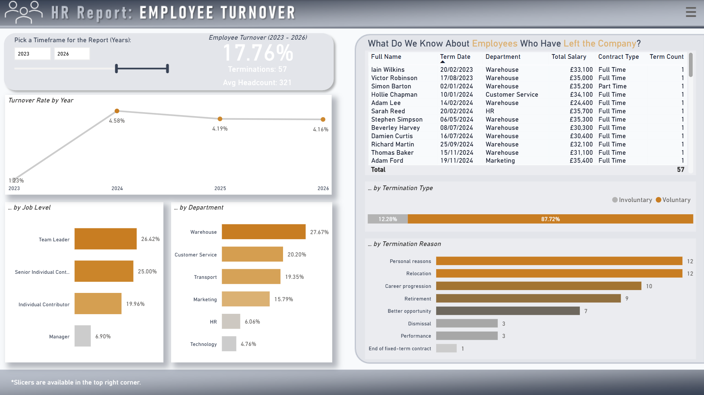
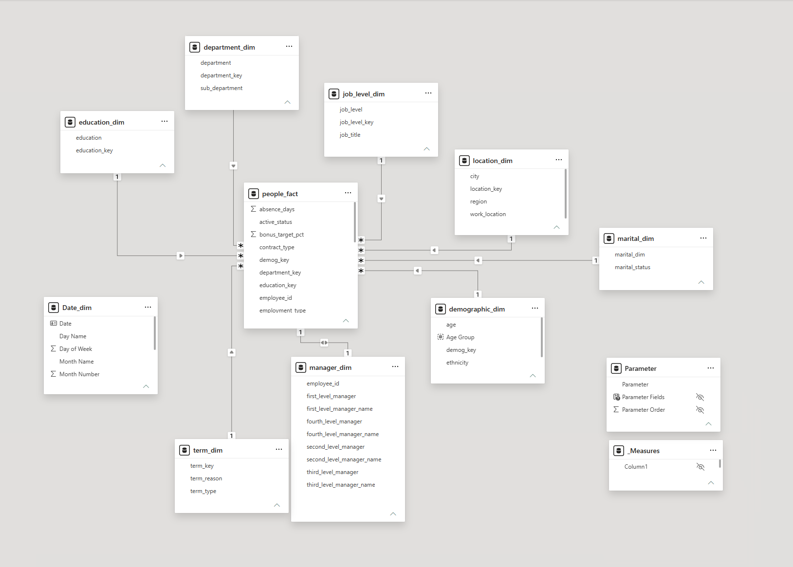

# HR Report — Power BI Dashboard

An interactive Power BI report consolidating **headcount, retention, and turnover** data into a single dashboard, enabling HR leadership to analyze workforce trends and support data-driven decision-making.

---

## 📋 Project Overview

The report lets users explore workforce data by department, job level, region, and demographics, with a flexible timeframe selector covering any period from 2017 onward. The dashboard consists of three main pages:

- **Headcount** — workforce structure (department, job level, region, age, gender, ethnicity, education, marital status), with a dedicated tooltip feature showing the top 20 highest- and lowest-paid employees on hover.
- **Employee Retention** — retention rate for the selected period, year-over-year trend, and a slope chart comparing retention between the first and last year of the selected range; the page includes a field parameter (dropdown menu) that lets users dynamically switch the comparison dimension in the slope chart — Department, City, Job Level, Age Group, Gender, Ethnicity, or Marital Status.
- **Employee Turnover** — turnover rate, number of departures, year-over-year trend, voluntary vs. involuntary split, and reasons for leaving.

Every page shares a common filter panel (slicer menu) available in the top-right corner, allowing filtering by: Age Group, Gender, Ethnicity, Department, Sub-department, Education, and Job Level.

---

## 🖼️ Screenshots

### 1. Headcount — Overview
Workforce structure by department, job level, region, education, and demographics (age, ethnicity, marital status, gender).

### 2. Headcount — Tooltip with Top 20 Highest/Lowest Earners
Tooltip feature available on selected visuals, showing a list of the 20 highest- and lowest-paid employees along with hire date and salary.

### 3. Headcount — Filter Panel (Slicer Menu)
Filter panel available on every page of the report, allowing users to filter data across multiple dimensions at once.

### 4. Employee Retention
Retention rate analysis over time, including a field parameter that lets users dynamically switch the comparison dimension in the slope chart.

### 5. Employee Turnover
Analysis of the turnover rate, reasons for leaving, and the voluntary vs. involuntary split.

---

## 🗂️ Source Data

The dashboard is powered by the `employees_source_data.csv` file, containing data for 600 employees, including:

| Category | Example Columns |
|---|---|
| Organizational data | `department`, `sub_department`, `job_title`, `job_level`, `first_level_manager` … `fourth_level_manager` |
| Employment | `employment_type`, `contract_type`, `hire_date`, `term_date`, `term_type`, `term_reason`, `active_status` |
| Compensation | `salary`, `bonus_target_pct`, `salary_band` |
| Location | `work_location`, `city`, `region` |
| Demographics | `gender`, `age`, `ethnicity`, `education`, `marital_status` |
| Performance & development | `performance_rating`, `engagement_score`, `absence_days`, `overtime_hours`, `training_hours`, `promotion_last_3yrs`, `years_experience` |

---

## ⚙️ Data Model & Logic

The model follows a star schema: a central fact table `people_fact` is related to a set of dimension tables describing each employee — `department_dim`, `job_level_dim`, `education_dim`, `location_dim`, `demographic_dim`, `marital_dim`, `manager_dim`, and `term_dim` (termination details).

**`Date_dim` as a disconnected parameter table:** `Date_dim` is not related to any other table in the model — there is no active relationship between `Date_dim` and `people_fact`. The table exists solely to drive the "Pick a Timeframe for the Report (Years)" slicer shown on every page of the report.

Since there's no relationship to propagate filters through, headcount, retention, and turnover logic for the selected period is implemented entirely in DAX:
- measures read the slicer-selected date/year range using `MIN`/`MAX`/`SELECTEDVALUE(Date_dim[...])`,
- these values are then explicitly compared against the `hire_date` and `term_date` columns in `people_fact` inside `FILTER()`, with the residual filter context from `Date_dim` cleared via `REMOVEFILTERS('Date_dim')`.

This approach (a **point-in-time headcount pattern on a disconnected date table**) is a deliberate and correct choice for this type of HR analysis — a standard 1:* relationship on a date key would not correctly handle "active as of a given day" logic (an employee hired before date X and not yet terminated by date X), so filtering is instead performed directly at the row level in `people_fact`.

### Key DAX Measures

| Measure | Purpose |
|---|---|
| `Starting Headcount` / `Ending Headcount` | number of active employees at the start/end of the selected period (based on `hire_date`/`term_date` vs. `MIN`/`MAX(Date_dim[Date])`) |
| `Headcount` | number of active employees as of any given day (`LASTDATE(Date_dim[Date])`) — used, e.g., for the "by Age" chart |
| `Average Headcount` | average of `Starting Headcount` and `Ending Headcount`, used as the denominator for `Turnover Rate` |
| `Retained Employees` / `Retention Rate` | number and share of employees active at the start of the period who remained employed through its end |
| `Hires` / `Terminations` | number of hires / departures within the selected period |
| `Turnover Rate` | `Terminations` / `Average Headcount` |
| `A to B Retention` | a variant of `Retention Rate` used in the slope chart, returning a result only for the first and last year of the selected range |
| `*_Text` / `*_Title` (e.g. `Ending Headcount Text`, `Retention Title`, `Slope Chart Title`) | dynamically generated visual labels and headers reflecting the selected year range |

The timeframe selector (2017+) drives all pages of the report simultaneously.

---

## 🛠️ Tools & Technologies

- **Power BI Desktop** — data model, DAX measures, visuals
- **Power Query** — cleaning and transforming source data
- **DAX** — retention, turnover, and point-in-time headcount measures
- **PowerPoint** - backgrounds and page layout
  
---
